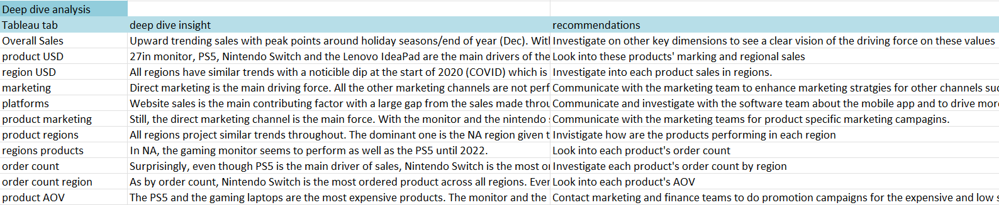
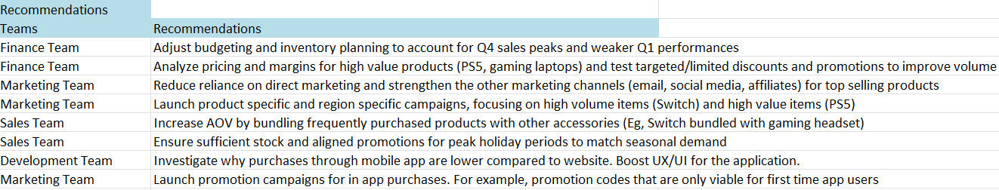
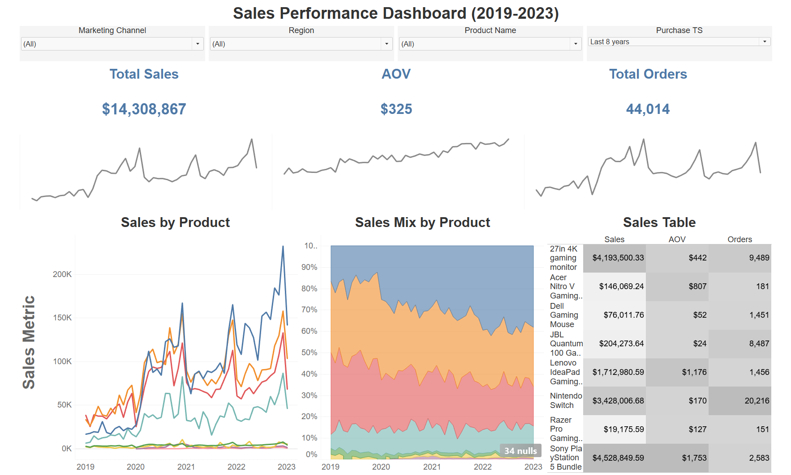
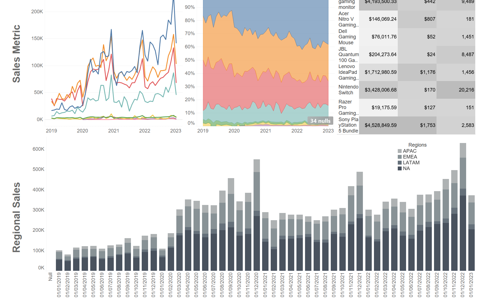

# 📊 GameTown — Retrospective Sales Analysis During COVID (2019–2023)

> Exploratory data analysis of a US-based game store's sales performance across the COVID period, covering data cleaning, trend analysis, and business recommendations.

🔗 **[View the Interactive Tableau Dashboard](https://public.tableau.com/views/GameTown_Dashboard/SalesDashboard?:language=en-GB&:sid=&:redirect=auth&:display_count=n&:origin=viz_share_link)**

---

## 🛠️ Tools & Skills

| Area            | Details                                                                |
| --------------- | ---------------------------------------------------------------------- |
| **Tools**       | Excel, Tableau                                                         |
| **Techniques**  | EDA, Data Cleaning, Pivot Tables, BI Dashboard Design                  |
| **Soft Skills** | Stakeholder-oriented thinking, Business Recommendations, Documentation |

---

## 📌 Key Findings & Business Recommendations

Analysis of 44,015 orders surfaced several actionable insights across product, marketing, and finance:

- **COVID drove a measurable shift** in sales volume and product mix, with clear disruption visible in 2020 followed by a strong recovery trend.
- **December 2022 saw a major sales spike**, largely driven by the Sony PlayStation 5 Bundle, signaling a high-demand seasonal window worth planning inventory around in future years.
- **Regional performance varied significantly** across the analysis period, pointing to opportunities for geo-targeted marketing efforts.
- Recommendations were documented per team (Marketing, Finance, Product, Operations) based on observed patterns. See the [Recommendations](#-tableau-analysis) section below.

---

## 📁 Dataset Overview

A US-based game store named **GameTown** (anonymized). All monetary values in USD.

**Sheet 1 `orders`** (44,015 rows)

| Column                  | Description                      |
| ----------------------- | -------------------------------- |
| USER_ID                 | User identifier                  |
| ORDER_ID                | Order identifier                 |
| PURCHASE_TS             | Purchase timestamp               |
| SHIP_TS                 | Shipping timestamp               |
| REFUND_TS               | Refund timestamp                 |
| PRODUCT_NAME            | Name of the product              |
| PRODUCT_ID              | Product identifier               |
| USD_PRICE               | Price in US Dollars              |
| PURCHASE_PLATFORM       | Platform where purchase was made |
| MARKETING_CHANNEL       | Marketing channel                |
| ACCOUNT_CREATION_METHOD | Account creation method          |
| COUNTRY_CODE            | Country code                     |

**Sheet 2 `regions`** Maps country codes to regions for geographical analysis.

> The dataset is based on real business data. The store name has been changed and some values were slightly adjusted to preserve anonymity, while keeping the structure and patterns representative of real-world small business scenarios.

---

## 🧹 Data Cleaning

Before any analysis, the raw dataset was reviewed and cleaned in Excel.

### Approach

- A copy of the raw dataset was preserved before any transformation
- New columns were added rather than overwriting originals
- All issues were logged in a dedicated `issue_log` worksheet

### Issue Log Structure

| Column            | Description                             |
| ----------------- | --------------------------------------- |
| table             | Sheet where the issue was found         |
| column            | Column affected                         |
| issue             | Description of the problem              |
| row count         | Number of affected rows                 |
| problem magnitude | Proportion relative to the full dataset |
| solvable?         | Whether the issue could be resolved     |
| solution          | Action taken                            |

### Cleaning Philosophy

Data imputation was used **cautiously**. In EDA, imputation can introduce bias if not justified. It was only applied when:

- Values could be reliably cross-checked against another dataset
- There was a clear business justification

---

## 🔍 Initial Analysis (Excel)

After cleaning, exploratory analysis began with a structured `insights_log` worksheet to document questions, assumptions, observations, and next steps.

### Primary Business Question

> _How did total revenue across all products evolve between 2019 and 2023?_

This guided the entire analysis, with the goal of helping product, marketing, and finance teams understand high-level trends from the COVID period.

### Pivot Table Analysis

A pivot table was built from the cleaned dataset:

- **Metric:** Sum of USD_PRICE
- **Granularity:** Monthly (balance between detail and readability)
- **Columns:** Product names (8 products total)

**Products analyzed:**

- 27in 4K Gaming Monitor
- Acer Nitro V Gaming Laptop
- Dell Gaming Mouse
- JBL Quantum 100 Gaming Headset
- Lenovo IdeaPad Gaming 3
- Nintendo Switch
- Razer Pro Gaming Headset
- Sony PlayStation 5 Bundle

Conditional color formatting was applied to highlight performance differences across products and months.

_Snippet of the pivot table_

### Documenting Initial Insights

Findings were recorded in a structured table within the `insights_log` worksheet, capturing:

- Observed patterns
- Potential explanations
- Follow-up questions
- Relevant teams to involve

**Example insight documented:**

> _Large sales spike in December 2022. Check promotional campaigns around that time. The most contributing product is the PS5._

This led to cross-team recommendations:

- **Finance** — Evaluate margins and ROI from the spike
- **Marketing** — Investigate whether seasonal campaigns drove the increase
- **Product / Operations** — Prepare inventory strategies for future high-demand periods

---

## 📈 Tableau Analysis

After the initial Excel analysis, a deeper exploration was performed in Tableau, covering:

- Revenue trends over time
- Product performance comparisons
- Regional sales distribution
- Platform and marketing channel impact

Insights were tracked in a `Deep Dive Analysis` table in Excel:

Each row captured the **Tableau worksheet**, the **finding**, and a **recommendation** for the relevant team.

### 📌 Business Recommendations

Insights were translated into a final `Recommendations` table, structured by team:

- **Left column** — Relevant team (Marketing, Finance, Sales, Development)
- **Right column** — Actionable recommendations based on analytical findings

---

## 📊 Tableau Dashboard

🔗 **[Open Interactive Dashboard](https://public.tableau.com/views/GameTown_Dashboard/SalesDashboard?:language=en-GB&:sid=&:redirect=auth&:display_count=n&:origin=viz_share_link)**

The dashboard is titled **Sales Performance Dashboard (2019–2023)** and is structured for a top-down reading flow — from executive summary to detailed breakdowns.

| Section    | Content                                                   |
| ---------- | --------------------------------------------------------- |
| **Top**    | Total Sales · Average Order Value (AOV) · Total Orders    |
| **Middle** | Product sales over time · Product performance comparisons |
| **Bottom** | Regional sales stacked graph                              |

---

## 📦 Deliverables

- ✅ Cleaned dataset (Excel)
- ✅ Issue log (data quality documentation)
- ✅ Initial EDA (Excel pivot tables + insights log)
- ✅ Deep dive analysis (Tableau)
- ✅ Business recommendations
- ✅ Interactive Tableau dashboard
