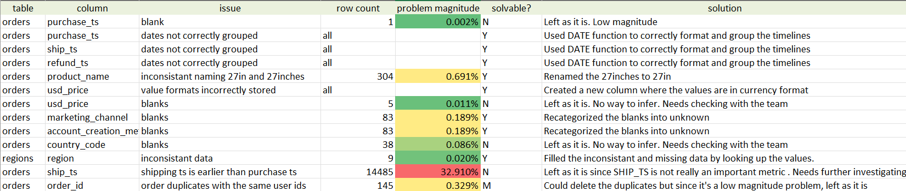
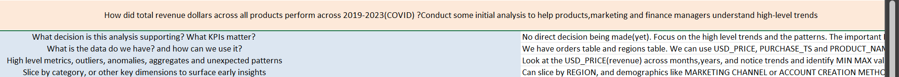
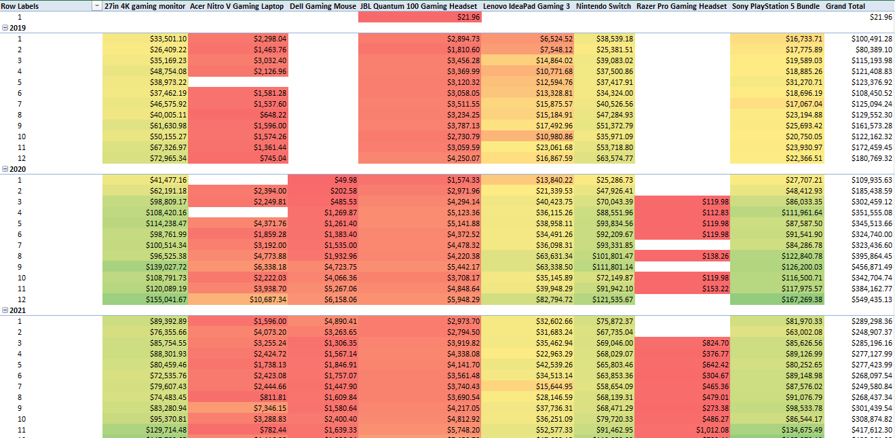
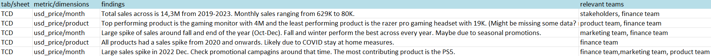

# 📊 Retrospective Sales Analysis During COVID (2019–2023)

This project performs a retrospective analysis of sales data before and during the COVID period (2019–2023).
The objective is to identify trends and answer key business questions so that stakeholders can better understand the impact of large-scale disruptions and be better prepared for similar events in the future.

The dataset is based on real business data.
The store name has been changed and some values were pre-selected and slightly manipulated to maintain anonymity and security of the business.However, the structure and patterns remain representative of real-world small business scenarios.

## 📁 Dataset Overview

The dataset comes from a US-based game store named "GameTown" (hypothetical name).
All monetary values are expressed in USD.

The dataset is provided as an Excel file (.xlsx) and contains two sheets.

Sheet 1 `orders` (raw dataset):

| Column Name             | Description                                          |
| ----------------------- | ---------------------------------------------------- |
| USER_ID                 | User identifier                                      |
| ORDER_ID                | Order identifier                                     |
| PURCHASE_TS             | Purchase timestamp                                   |
| SHIP_TS                 | Shipping timestamp                                   |
| REFUND_TS               | Refund timestamp                                     |
| PRODUCT_NAME            | Name of the product                                  |
| PRODUCT_ID              | Product identifier                                   |
| USD_PRICE               | Price in US Dollars                                  |
| PURCHASE_PLATFORM       | Platform where purchase was made                     |
| MARKETING_CHANNEL       | Marketing channel that the purchase was done through |
| ACCOUNT_CREATION_METHOD | Account creation method                              |
| COUNTRY_CODE            | Country code                                         |

The dataset contains **44,015** rows.

Sheet 2 `regions`:

This sheet maps country codes to their corresponding regions and is used for geographical analysis.

## 🧹 First Glance & Data Cleaning

Before starting any analysis, an initial review and cleaning of the dataset is required.
For this project, Excel is used for the first data preparation steps.

As a safety measure, a copy of the raw dataset is created before any transformation is applied.

### 📝 Issue Log

All detected issues are documented in a dedicated worksheet named `issue_log`.
This sheet tracks data quality problems and the actions taken to resolve them.

| Column Name       | Description                                                             |
| ----------------- | ----------------------------------------------------------------------- |
| table             | The table/sheet the problem was located at                              |
| column            | The column of the table the problem was located at                      |
| issue             | The issue/problem found                                                 |
| row count         | The number of rows affected by this issue                               |
| problem magnitude | The magnitude/proportion of the problem in relation to the entire table |
| solvable?         | Is the problem solvable currently?                                      |
| solution          | Appropirate measure taken to the issue/problem                          |

The purpose of the `issue_log` is to :

- Maintain transparency
- Document cleaning decisions
- Simplify communication with stakeholders or team members

### 🧼 Data Cleaning Strategy

Several issues were identified during the initial scan. Some could be corrected immediately, while others required further investigation.

Although techniques such as data imputation exist, they are used cautiously in data analysis.
Unlike predictive modeling, EDA focuses on understanding what the data currently represents. Imputation can introduce bias if not properly justified.

Imputation is only considered when:

- Values can be reliably cross-checked with another dataset
- There is a strong business justification

To preserve data integrity:

- A duplicate sheet is created before cleaning
- New columns are created instead of overwriting originals

After the data cleaning process,

- Solutions are recorded in the issue_log
- The proportion of affected rows is calculated to quantify impact

## 🔍 Initial Analysis

After cleaning, exploratory analysis begins.

To avoid unfocused exploration, an `insights_log` worksheet is created to document:

- Questions
- Assumptions
- Observations
- Next steps

As this is a project without external stakeholders to ask us the questions and give decisions, we will have to put ourselves in the stakeholder's position and ask business related questions.

### Primary Business Question

> How did total revenue across all products evolve between 2019 and 2023 (COVID period)?  
> Conduct an initial analysis to help product, marketing, and finance teams understand high-level trends.

This question guides the entire exploratory analysis.

As in above image, relevant questions and initial steps are noted down for the analysis.

### 📈 Pivot Table Analysis

To answer the main question, pivot tables are used.

A pivot table `(TCD – Tableau Croisé Dynamique)` is created from the cleaned dataset.

- Metric (Value): Sum of USD_PRICE
- Time granularity: Monthly (good balance between detail and readability)

For the columns, product names are added to observe how each product performs over time.

In a real-world dataset, there could be hundreds of products, which would make the pivot table difficult to interpret. In such cases, analysts typically pre-select a subset of products, such as:

- Top 10 best-performing products
- Newly launched products
- Strategic products with high margins

This approach narrows the scope of the analysis and makes trends easier to interpret.

For this project, the dataset includes 8 products:

- 27in 4K gaming monitor
- Acer Nitro V Gaming Laptop
- Dell Gaming Mouse
- JBL Quantum 100 Gaming Headset
- Lenovo IdeaPad Gaming 3
- Nintendo Switch
- Razer Pro Gaming Headset
- Sony PlayStation 5 Bundle

_Snippet of the pivot table_

Conditional color formatting is applied to the pivot table to make patterns and performance differences easier to identify across products and months.

### 📝 Documenting Initial Insights

As done earlier with the issue_log, a structured table is created to document insights and analytical observations.

_Initial findings table_

This table is created in the `insights_log` worksheet and records:

- Observed patterns
- Potential explanations
- Follow-up questions
- Relevant teams that may need to investigate further

For example one of the findings is :

> `Large sales spike in 2022 Dec. Check promotional campagins around that time. The most contributing product is the PS5.`

Based on this observation, multiple teams may be involved:

- Finance Team
  - Evaluate margins and overall ROI from the spike in revenue.

- Marketing Team
  - Investigate promotional campaigns or seasonal marketing efforts that may have driven the increase in sales.

- Product / Operations Team
  - Prepare inventory and warehousing strategies for upcoming high-demand periods.

Documenting insights in this way helps transform raw analysis into actionable business intelligence, enabling cross-team collaboration and data-driven decision-making.
